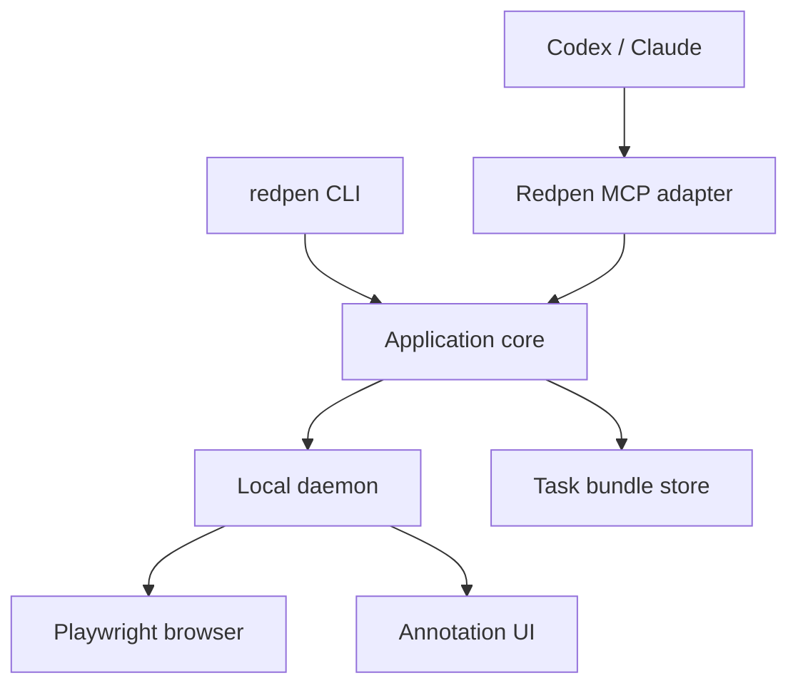
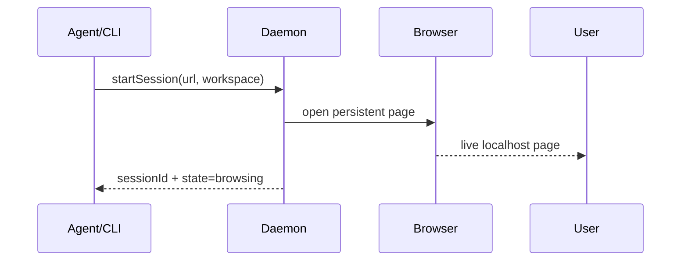
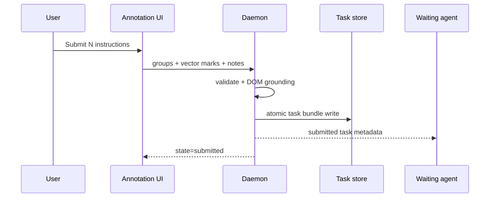
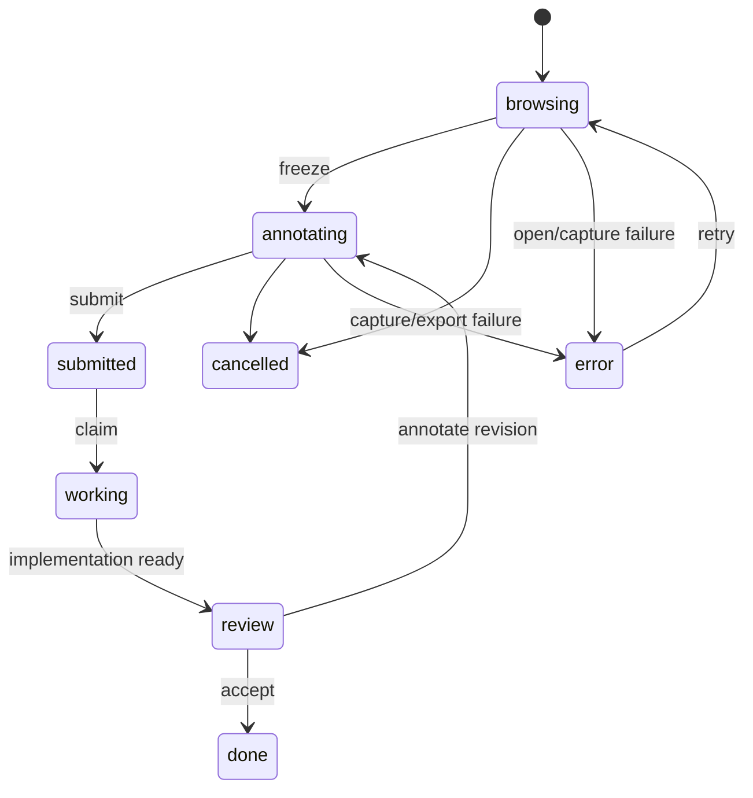

# Redpen 아키텍처

## 1. 범위와 전제

이 문서는 로컬 CLI로 실행되는 Redpen MVP의 논리 및 런타임 아키텍처를 정의한다.

- 구현 언어: TypeScript
- 런타임: Node.js
- UI: React 기반 local web app
- 브라우저 제어: Playwright persistent Chromium context
- annotation engine: tldraw 우선 검증, vendor schema는 외부 포맷으로 노출하지 않음
- 통신: localhost HTTP + WebSocket 또는 SSE
- agent adapter: MCP stdio transport
- 저장: 로컬 파일 기반 task bundle
- 대상: Codex CLI/IDE 및 Claude Code 같은 로컬 coding agent

MVP에서 remote/cloud agent와 사용자 PC 사이의 브리지는 지원하지 않는다. 해당 환경에서는 agent의 `localhost`와 사용자의 `localhost`가 다를 수 있으므로 별도 터널 또는 browser extension 설계가 필요하다.

## 2. 아키텍처 원칙

### 2.1 CLI first

모든 use case는 CLI와 application core만으로 수행할 수 있어야 한다. MCP handler와 UI route에 business logic을 중복 작성하지 않는다.

### 2.2 One canonical task format

UI 내부 state, canvas library state, MCP response를 그대로 영구 포맷으로 쓰지 않는다. `@redpen/protocol`의 versioned schema가 유일한 canonical format이다.

### 2.3 Snapshot consistency

Screenshot, viewport metadata, DOM index는 같은 capture operation에서 생성한다. 서로 다른 렌더 시점의 데이터를 합치지 않는다.

### 2.4 Recoverable sessions

UI 또는 MCP client가 종료되어도 session ID로 다시 열고 조회할 수 있어야 한다. 제출은 임시 디렉터리에 쓴 뒤 atomic rename으로 완료한다.

### 2.5 Local trust boundary

Daemon은 `127.0.0.1`에만 bind하고, random session token을 요구한다. Browser profile과 민감한 임시 DOM index는 repository 밖에 저장한다.

## 3. 컴포넌트



### 3.1 `@redpen/protocol`

책임:

- schema version 및 TypeScript type
- runtime validation
- session/task/group/mark state 정의
- 좌표계와 geometry primitive
- CLI JSON 및 MCP response DTO
- migration entry point

추천 구현: Zod 또는 동등한 schema-first validator. 구체 라이브러리는 구현 시 확정한다.

### 3.2 Application core

책임:

- session 생성/조회/상태 전이
- browser capture orchestration
- task submission transaction
- group/mark/target 연결
- task bundle 저장과 조회
- review revision 생성

CLI, daemon route, MCP tool은 모두 이 service layer를 호출한다.

### 3.3 CLI

책임:

- human-readable command surface
- `--json` machine contract
- daemon discovery 및 자동 시작
- exit code와 오류 표준화
- foreground/background 실행 관리

예상 명령:

```text
redpen init
redpen daemon start|stop|status
redpen open <url> [--viewport 1440x900] [--project <path>] [--json]
redpen list [--state submitted] [--json]
redpen status <session-id> [--json]
redpen wait <session-id> [--timeout 600] [--json]
redpen show <session-id>
redpen review <session-id> [--url <url>]
redpen close <session-id>
redpen mcp
```

JSON mode 규칙:

- stdout에는 하나의 JSON document만 출력한다.
- progress와 사람이 읽는 log는 stderr로 보낸다.
- ID와 path는 절대 임의로 축약하지 않는다.
- 성공/실패 schema를 versioning한다.
- timeout은 session을 삭제하지 않는다.

### 3.4 Local daemon

책임:

- local UI asset serving
- session HTTP API
- submission notification stream
- Playwright browser process 관리
- in-memory visible DOM index 유지
- session lock 및 crash recovery

Daemon discovery record 예시:

```json
{
  "pid": 41234,
  "port": 43127,
  "token": "random-local-token",
  "startedAt": "2026-09-01T05:00:00Z"
}
```

위 파일은 OS별 application data 디렉터리에 저장하고 권한을 사용자 전용으로 제한한다. Repository에 저장하지 않는다.

### 3.5 Managed browser

MVP는 Playwright가 관리하는 전용 Chromium profile을 사용한다.

이유:

- 현재 사용 중인 일반 Chrome profile을 잠그거나 훼손하지 않는다.
- 페이지 탐색, screenshot, DOM evaluation을 한 process에서 통제할 수 있다.
- 로그인 상태를 Redpen 전용 profile 안에서 유지할 수 있다.
- CLI와 MCP가 동일한 browser session을 다룰 수 있다.

Profile 위치는 global application data 아래에 두며 task bundle에 cookie나 storage state를 복사하지 않는다.

### 3.6 Annotation UI

화면은 크게 두 영역으로 나뉜다.

- Canvas: 원본 screenshot + vector annotation + group badge
- Sidebar: global note + Instruction Group cards + submit control

필수 tool:

- freehand pen
- arrow
- rectangle
- ellipse
- text
- mask/whiteout
- select/move
- erase
- undo/redo

그룹을 선택하면 현재 pen color와 신규 mark의 `groupId`가 함께 바뀐다. 색은 UI hint이며 ID가 실제 연결 기준이다.

tldraw를 사용할 경우 내부 store snapshot을 task schema로 직접 저장하지 않는다. Adapter가 필요한 mark만 Redpen schema로 변환한다. 첫 technical spike에서 다음을 검증한다.

- screenshot을 잠긴 background로 사용 가능
- 현재 group에 따라 신규 shape style 강제 가능
- group badge와 sidebar selection 동기화 가능
- freehand/shape/text를 SVG와 자체 JSON으로 변환 가능
- mask의 opaque rendering과 export 가능

검증이 실패하면 annotation engine을 Konva 등 저수준 canvas로 교체한다.

## 4. 런타임 흐름

### 4.1 Session start



Daemon은 URL을 검증하고, 기본적으로 loopback host가 아니면 거부한다. 페이지가 열리지 않으면 dev server를 대신 추측해 실행하지 않고 명확한 오류를 반환한다. 프로젝트 실행은 coding agent 또는 사용자가 담당한다.

### 4.2 Freeze and capture

Live page에는 Shadow DOM으로 격리된 최소 floating control을 삽입한다. 사용자가 `이 화면 표시하기`를 누르면:

1. control을 숨긴다.
2. animation과 caret 등 불안정한 요소를 가능한 범위에서 정지한다.
3. current URL, viewport, scroll, device scale metadata를 읽는다.
4. visible DOM index를 memory에 만든다.
5. viewport screenshot을 캡처한다.
6. annotation UI를 별도 local tab으로 연다.
7. session state를 `annotating`으로 바꾼다.

Screenshot은 Playwright API로 생성하고, overlay 좌표는 CSS pixel 기준으로 유지한다. PNG 실제 pixel 크기와 CSS viewport 크기의 scale factor를 metadata에 저장한다.

### 4.3 Visible DOM index

캡처 시점에는 아직 mark가 없으므로 viewport 안의 후보 요소 index를 memory에 만든다.

후보 수집:

1. top document의 element를 순회한다.
2. `display:none`, `visibility:hidden`, zero-size, viewport 밖 element를 제외한다.
3. rect, tag, role, accessible name, visible text 요약, id, `data-testid` 계열, class hint를 수집한다.
4. input value, password, token, script/style content는 수집하지 않는다.
5. element hierarchy를 opaque temporary ID로 연결한다.

제출 시 mark geometry와 후보 rect를 교차시킨다.

- circle/rectangle/freehand: bounding box와 path proximity
- arrow: start point를 source target, end point를 destination area 후보로 우선 처리
- text: anchor point와 nearest containing element
- mask: 덮은 영역과 intersecting targets
- 빈 영역 sketch: nearest layout container와 desired bounding box

영구 저장은 교차 또는 인접한 target과 제한된 부모/형제 summary만 한다. 전체 temporary index는 제출/취소 후 폐기한다.

### 4.4 Submit



## 5. 상태 모델



상태 전이는 application core가 검증한다. CLI나 MCP가 storage 파일을 직접 편집하지 않는다.

## 6. Canonical data model

초기 schema는 미래의 multi-frame revision을 막지 않도록 `frames` 배열을 사용하되, MVP UI는 한 frame만 만든다.

```ts
interface VisualSession {
  schemaVersion: 1;
  id: string;
  state: 'browsing' | 'annotating' | 'submitted' | 'working' | 'review' | 'done' | 'cancelled' | 'error';
  workspaceRoot: string;
  targetUrl: string;
  activeTaskId?: string;
  lastError?: { code: string; message: string };
  createdAt: string;
  updatedAt: string;
}

interface VisualTask {
  schemaVersion: 1;
  id: string;
  sessionId: string;
  revision: number;
  state: 'submitted' | 'working' | 'review' | 'done' | 'cancelled';
  createdAt: string;
  updatedAt: string;
  workspace: {
    root: string;
  };
  globalNote?: string;
  frames: Frame[];
  groups: InstructionGroup[];
  marks: Mark[];
  targets: DomTarget[];
}

interface Frame {
  id: string;
  url: string;
  screenshot: string;
  annotated: string;
  overlaySvg: string;
  viewport: { width: number; height: number; deviceScaleFactor: number };
  scroll: { x: number; y: number };
  capturedAt: string;
}

interface InstructionGroup {
  id: string;
  number: number;
  color: string;
  note?: string;
  state: 'draft' | 'ready';
  markIds: string[];
  targetIds: string[];
}

type Mark =
  | FreehandMark
  | ArrowMark
  | RectangleMark
  | EllipseMark
  | TextMark
  | MaskMark;

interface MarkBase {
  id: string;
  frameId: string;
  groupId: string;
  bounds: { x: number; y: number; width: number; height: number };
  normalizedBounds: { x: number; y: number; width: number; height: number };
}

interface DomTarget {
  id: string;
  frameId: string;
  groupIds: string[];
  rect: { x: number; y: number; width: number; height: number };
  tag: string;
  role?: string;
  accessibleName?: string;
  text?: string;
  selectorHints: string[];
  attributes: Record<string, string>;
  relation: 'intersects' | 'contains' | 'nearest' | 'arrow-source' | 'arrow-destination';
  context?: {
    parent?: ElementSummary;
    siblings?: ElementSummary[];
    computedLayout?: Record<string, string>;
  };
}
```

`computedLayout`은 allowlist 방식으로 제한한다. 예: `display`, `position`, `flex-*`, `grid-*`, `gap`, `padding`, `margin`, `width`, `height`, typography 핵심 값.

## 7. Task bundle

기본 저장 위치:

```text
<workspace>/.redpen/tasks/<task-id>/
├── task.json
├── task.md
├── frames/
│   └── frame-001/
│       ├── source.png
│       ├── overlay.svg
│       └── annotated.png
└── checksums.json
```

작성 규칙:

- `.tmp-<task-id>`에 먼저 작성한다.
- 모든 asset을 쓴 뒤 schema validation과 checksum을 수행한다.
- 성공하면 최종 디렉터리로 atomic rename한다.
- `.redpen/latest.json`은 `{ taskId, path, submittedAt }`만 가리킨다.
- `.redpen/`은 기본적으로 gitignore 대상이다.
- `task.md`는 사람이 읽는 요약이며 `task.json`이 canonical source다.

## 8. MCP adapter와 Skill

MCP server는 stdio transport로 시작하며 CLI와 같은 application core를 사용한다.

초기 tool:

```text
redpen_start_session(url, workspace_root?, viewport?)
redpen_wait_for_submission(session_id, timeout_seconds?)
redpen_get_task(task_id | session_id)
redpen_update_task(task_id, state, summary?)
redpen_open_review(task_id, url?)
redpen_cancel_session(session_id)
```

`wait_for_submission` timeout은 실패가 아니라 현재 상태와 재조회 방법을 반환한다. MCP host별 long-running tool 제한이 다를 수 있으므로 `get_task` fallback을 항상 제공한다.

Skill 책임:

1. “Redpen 열어”, “이 페이지 표시할게” 같은 요청에서 session을 시작한다.
2. 사용자에게 live page 탐색과 제출 방법을 짧게 안내한다.
3. 제출을 기다리거나 이후 요청에서 task를 조회한다.
4. 원본, 합성본, overlay, group note, DOM target을 함께 읽는다.
5. 각 group의 의도와 관련 source 후보를 정리한다.
6. 기본적으로 구현 계획을 작성하고, 사용자가 명시한 경우에만 수정한다.
7. 수정 후 review session을 연다.

Skill은 task format 해석 절차를 제공할 뿐, Redpen app logic을 복제하지 않는다.

## 9. 보안 및 프라이버시

### 기본 제한

- daemon은 loopback interface에만 bind한다.
- local API는 random bearer/session token을 요구한다.
- MVP는 loopback target URL만 허용한다.
- browser profile은 repository 밖 전용 디렉터리를 사용한다.
- password input, hidden input, input value를 DOM metadata에 저장하지 않는다.
- cookie, localStorage, sessionStorage, network body를 task에 저장하지 않는다.
- full DOM HTML을 기본 저장하지 않는다.
- task directory 권한은 가능한 범위에서 현재 사용자로 제한한다.

### 향후 외부 URL 지원 조건

- 사용자의 명시적 opt-in
- host allowlist
- 화면과 DOM에 민감정보가 포함될 수 있다는 경고
- 보존 기간 및 삭제 기능
- 브라우저 extension 또는 별도 authenticated bridge 검토

## 10. 오류와 복구

| 상황 | 기대 동작 |
|---|---|
| URL 접속 실패 | 세션을 `error`로 표시하고 `lastError`와 재시도 명령 반환 |
| Daemon 재시작 | global session record를 읽고 제출된 task는 유지, browser session은 재생성 안내 |
| Annotation tab 닫힘 | `redpen show <id>`로 다시 열기 |
| MCP wait timeout | 세션 유지, `get_task`/`status`로 재조회 |
| 제출 중 crash | 임시 디렉터리 정리, 기존 task에는 영향 없음 |
| DOM grounding 실패 | 이미지는 제출하고 target 없는 group으로 표시 |
| Canvas vendor export 실패 | 원본 mark JSON을 보존하고 제출 차단 또는 명확한 재시도 제공 |

## 11. 기술 근거와 참고 문서

- Playwright는 page, full-page, element screenshot을 파일 또는 buffer로 생성할 수 있다: <https://playwright.dev/docs/screenshots>
- Playwright persistent browser context API: <https://playwright.dev/docs/api/class-browsertype>
- Playwright visual comparison은 렌더 환경 차이에 민감하므로 review diff는 동일 환경에서 수행해야 한다: <https://playwright.dev/docs/test-snapshots>
- tldraw image export 기능: <https://tldraw.dev/sdk-features/image-export>
- MCP TypeScript SDK stdio transport: <https://ts.sdk.modelcontextprotocol.io/v2/serving/stdio.html>
- OpenAI의 Skill/MCP 역할 구분: <https://developers.openai.com/plugins/concepts/skills>
- Claude Code Skill 구조: <https://code.claude.com/docs/en/skills>
